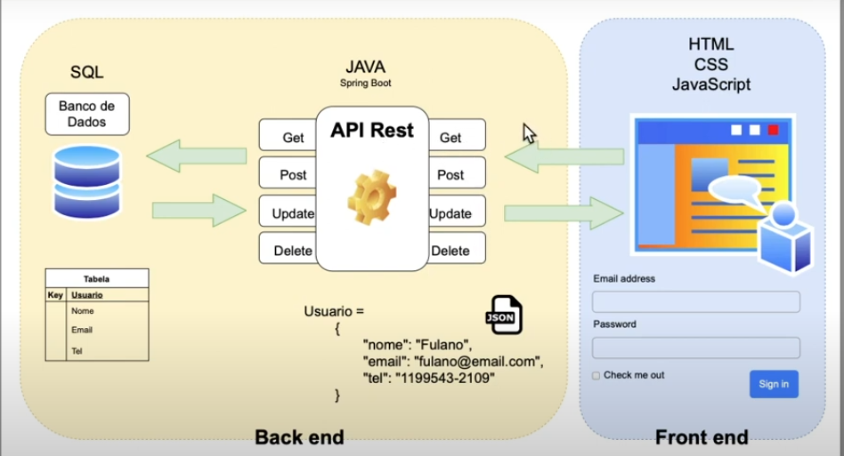
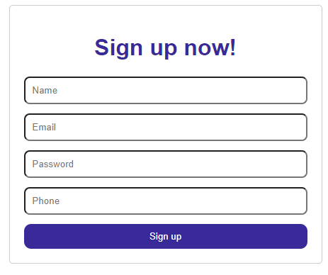

# SpringTideWeb

SpringTideWeb is a web application project developed using the Spring Boot framework.

## Technologies Used

- HTML
- CSS
- JavaScript
- Spring Boot
- Hibernate
- MySQL

## Description

SpringTideWeb is a web application that allows users to manage and organize their tasks. It provides a user-friendly interface for creating, updating, and deleting tasks. The application is built using HTML, CSS, and JavaScript for the frontend, and Spring Boot with Thymeleaf for the backend.

## Project Structure

The project follows a typical structure for a Spring Boot application:

- `src/main/java`: Contains the Java source code
  - `com.example.springtideweb`: Main package for the application
    - `controller`: Contains the controller classes that handle the HTTP requests
    - `model`: Contains the entity classes that represent the data models
    - `repository`: Contains the repository interfaces for data access
    - `service`: Contains the service classes for business logic
- `src/main/resources`: Contains the application resources
  - `static`: Contains static files such as CSS and JavaScript
  - `templates`: Contains the Thymeleaf templates for HTML views
  - `application.properties`: Contains the configuration properties for the application

## How to Run the Project

To run the SpringTideWeb project, follow the steps below:

1. Clone this repository to your local environment.
2. Configure the MySQL database and update the connection settings in the `application.properties` file.
3. Build the project using Maven or your preferred build tool.
4. Run the generated JAR file using the command `java -jar <jar-file-name>.jar`.
5. Open a web browser and access the application at `http://localhost:8080`.

## SQL Script

To create the necessary database structure for the SpringTideWeb application, execute the following SQL script:

```sql
CREATE DATABASE banco_de_usuarios;
USE banco_de_usuarios;

DROP DATABASE banco_de_usuarios;

CREATE TABLE usuario(
	id INT AUTO_INCREMENT PRIMARY KEY,
    nome_completo VARCHAR(200) NOT NULL,
    username VARCHAR(100) UNIQUE,
    email VARCHAR(50) NOT NULL UNIQUE,
    senha TEXT NOT NULL,
    telefone VARCHAR(15) NOT NULL
);
```

# Images

## 1. the project was created from the following structure:



## 2. Screenshot of the program running in a browser:



## Contributing

If you would like to contribute to this project, you can follow these steps:

1. Fork the repository and clone it to your local machine.
2. Create a new branch for your feature or bug fix.
3. Make the necessary changes and commit them.
4. Push your changes to your forked repository.
5. Submit a pull request to the main repository.

## License

This project is licensed under the [MIT License](LICENSE).

Feel free to explore and enhance the SpringTideWeb application!

